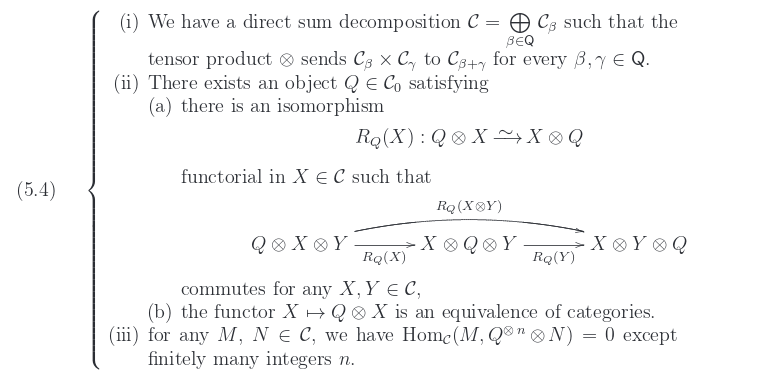

As [I wrote a while ago](/202/), I've been working to change my language to keep the notion of "mathematics on the web" and "equation/formula rendering on the web" separate. That's hard since I've been mostly writing about equation rendering in the past few years; a professional risk, when you spent those years managing [the open source project](https://www.mathjax.org) that provides the best and by far most popular equation rendering solution for the web.

It's also difficult because most people in this field *like* this confusion, especially if they have a stake in it. It's obviously a better sales pitch to say you're helping all of STEM even if you're actually working on a set of (arguably tricky) visual/print layout techniques. I don't want to sound too cynical here; for many people it does come from the heart, they think they are helping STEM this way and it is what drives them. Besides, as they say, you cannot change others only yourself.

## A real life math fragment

These days I spent much more time on the document level and, mostly, on mathematical documents. That brings up a slew of interesting problems but many are too ephemeral to share. The other day I had a particularly interesting piece of content as it highlights some aspects of the problem of this identification.

In [this paper](https://arxiv.org/abs/1412.8106) you find the following



<p id="204-explainer">
The layout captured in this image combines a label (5.4) with an ordered list of three mathematical statement, one of which include a sublist of two items. Of course, these statements include quite a few bits of equational content but those aren't that important here. Instead, what's interesting is that a stretchy brace is used a visual cue that connects the single label with the list of statements, aligning its center with the label and extending to the height of the list.
</p>

## Take me to the web

How do you realize this kind of layout on the web? (And, for that matter, in LaTeX?) Before answering that, it's worth to dive a little deeper.

There are two conflicting details here. On the one hand, the label (as per source and context) is actually an equation label. This means the authors intended this list of statements (each being a self-contained sentence with several equational elements interspersed) to be treated as a single piece of equational content. Much like tables, images, or (since we're in a math paper) theorem environments, this is an important piece of structural information and should not be lost.

On the other hand, the list is (nested) ordered (text) list and it is encoded as such by the authors. This is obviously an important piece of structural information and should not be lost.

And that's a bit of a problem both for the web and for LaTeX: there's no system for equation layout with a concept for ordered list built-in. And there's no text layout system with stretchy braces.

If you look in the TeX source of the paper, you'll see how this was hacked using `\parbox`. On the web, you have a harder time since in practical terms you can't really do this kind of hack of switching from equation layout to text layout. In theory (i.e., HTML5 spec dream land), you could try something like this

```html
<math side="left">
  <mtable>
    <mlabeledtr>
        <mtd>
          <mtext>(5.4)</mtext>
        </mtd>
        <mtd>
          <mo>{</mo>
          <mtext>
            <ol>
              ...
            </ol>
          </mtext>
        </mtd>
    </mlabeledtr>
  </mtable>
</math>
```

Now this won't work that well in real life. But the real question for me is: is that even correct? (in which sense)? This is a `<math>` element consisting really only of text while the purely visual brace is the only element with "semantic" markup. Hm...

## so what?

I find this one interesting because the problem is a case of visual layout clouding one's judgement. You want to use stretchy braces, so in TeX you need math mode and the rest follows pretty "rationally", no matter the hackiness. After all, it's print; no need to care about anything but the looks.

On the one hand, there's the gut reaction to say that authors should not do things like this. This may be based on the simple principle that, when you need to hack around a lot, you're probably doing something wrong.

A less toxic response may be to criticize the content structure: should this really be an equation label? Isn't it more like a theorem-environment anyway? If not, should this enumeration not be numbered as sub-equations? And isn't the brace a legacy from organizing content on a blackboard rather than something for print layout to mimic (let alone web layout)?

If I was one of the authors, I'd probably respond grumpily: how dare you question that this is the best (perhaps not good but best) way to represent this particular piece of mathematical content that I arrived at after years of study of a deep and complex research topic?

And they'd be right because this really only evades the two actual problems: the confusion of "equation" and "mathematical fragment" and the problem of stretchy characters.

On the one hand, it's clear that this is a (complicated) unit of *mathematical* information. It must be treated as one. And while I would argue it is not an equation/formula (and certainly not in the sense of "equational layout" let alone MathML's idea of it), if the authors want to count it as such, there should be a way. But on the web we're severely limited when it comes to marking anything "an equation", especially when it structures like regular lists come into play.

From a layout perspective is, however, the only notable problem is the stretched brace. It has no meaning here (if it ever has); it's merely a stylistic element to help visually connect a list with a label. It is not "mathematics" or even "equational" in any sense of the word. And yet with the current state of web technology, the only way to realize it is by using tools specialized for precisely equation layout (and usually with misleading "semantics" to boot).

But we should be able to do this, no?

---

## Coda.

Here's an example (using a technique of pure CSS stretchy braces developed by Davide Cervone for [MathJax](https://www.mathjax.org) v3).

<p data-height="265" data-theme-id="dark" data-slug-hash="OQQVgx" data-default-tab="result" data-user="pkra" data-embed-version="2" data-pen-title="case study: arxiv.org/1412.8106" class="codepen">See the Pen <a href="https://codepen.io/pkra/pen/OQQVgx/">case study: arxiv.org/1412.8106</a> by Peter Krautzberger (<a href="https://codepen.io/pkra">@pkra</a>) on <a href="https://codepen.io">CodePen</a>.</p>
<script async src="https://static.codepen.io/assets/embed/ei.js"></script>


---

## Addendum 2018-05-29

I read up on the changes in the HTML 5.3 working draft and realized that my HTML5-ish example above (using an ordered list inside MathML) is not even valid HTML - oh my! As it turns out, the integration of MathML into [HTML](https://html.spec.whatwg.org/#mathml) states that only [phrasing content](https://html.spec.whatwg.org/#phrasing-content-2) is allowed inside MathML token elements (and lists are not phrasing content). Well, one more reason never to use MathML on the web - but you already knew that.
